# AI Crypto Hedge Fund

Educational, reproducible Python repository for an AI-agent-based cryptocurrency
hedge-fund research assignment. This is a historical backtesting and analysis system,
not investment advice, not a profitability claim, and not an enabled live trading bot.

The default run is long-only, unlevered, spot-only, daily-bar, and USDT-cash based.
It uses included frozen data and does not require exchange credentials, LLM keys,
paid services, or live downloads.

## Architecture

The five assignment levels are different configurations of one shared, panel-native
architecture. Level 1 is a one-symbol run through the same broker, ledger, costs,
risk, metrics, artifact, and reporting stack used by Levels 2-5.

```mermaid
flowchart LR
  D[Frozen daily OHLCV + instruments] --> F[Feature pipeline]
  F --> A[Typed signal agents]
  A --> O[Orchestrator and decision trace]
  O --> R1[Pre-allocation risk gate]
  R1 --> P[Portfolio allocation and rebalance policy]
  P --> R2[Post-allocation risk gate]
  R2 --> B[Simulated broker]
  B --> L[Ledger, costs, orders, fills]
  L --> M[Metrics, monitoring, reports]
```



Key conventions:

- Daily UTC bars are timestamped by bar start.
- Features are computed from completed bars only.
- Decisions execute at the next available open, never at the same close used to form
  the signal.
- Fees and slippage are charged only on risky-asset notional actually traded.
- Risk has two stages: before allocation and after candidate weights are proposed.
- Signal agents emit typed scores, confidence, horizons, cutoffs, and reason codes;
  they cannot place orders or mutate the ledger.
- Live exchange execution is out of scope. The repository contains only the offline
  research/simulation path for the default run.

## Setup And Release Commands

Required Python: 3.11. The project uses `uv`, `pyproject.toml`, and a committed
`uv.lock`.

```bash
uv sync --frozen
make validate-data
make lint
make test
make notebook-full
make presentation
```

For interactive notebook use, select this repository interpreter:
`./.venv/bin/python`. Do not install notebook packages into System Python;
`ipykernel` is managed by `uv` in the project environment.

Optional local hooks are configured in `.pre-commit-config.yaml`:

```bash
uv run pre-commit run --all-files
```

Additional stable commands:

```bash
make setup
make data              # optional CCXT/Binance public-data refresh path
make experiments-val   # train/validation only
make pretest-freeze    # creates/validates the frozen final-test lock
make final-test        # forbidden after exposure unless explicitly authorized
make notebook-fast     # non-final smoke notebook
make report
make all-fast
```

Do not rerun `make final-test` for release review. Final-test exposure is already
`EXPOSED`, and the accepted frozen artifacts are committed under
`artifacts/final_test/c33b5eb396f6/`.

## Included Data

The default offline data bundle is committed at:

- `data/processed/ohlcv_daily.parquet`
- `data/processed/instruments.parquet`
- `data/manifests/ohlcv_daily_manifest.json`

Snapshot summary:

- Source: Binance spot via CCXT public OHLCV.
- Quote currency: USDT.
- Frequency: daily bars.
- Date range: 2021-01-01 through 2025-12-31 UTC where available.
- Rows and symbols: 158,511 rows across 163 symbols.
- Data hash: `9f539f38394240f5dcd922b23d234008a84a357c38ef9f2d8197acfab80d7e14`.
- Instrument hash: `df7777139dd4106032280339818ba18179882c8e19141f374d87cb8e7bddf18b`.

`make validate-data` checks schema, hashes, timestamp semantics, coverage, and the
full-mode data eligibility proof. The current data-level proof reports 104 eligible
and scored pairs at `2025-07-01T00:00:00+00:00`.

## Five Levels

| Level | Scope | Evidence |
| --- | --- | --- |
| 1 | BTC/USDT SMA baseline vs buy-and-hold | `artifacts/metrics/level_1.csv` |
| 2 | Technical, econometric, ML, and ensemble agents on BTC/USDT | `artifacts/monitoring/level_2_decision_trace.json` |
| 3 | Static 5-7 asset portfolio with prior 12-month estimation | `artifacts/weights/level_3.parquet` |
| 4 | Adaptive small-portfolio dynamic rebalancing | `artifacts/monitoring/level_4_rebalance_log.parquet` |
| 5 | Large-universe dynamic portfolio, 100+ pair scoring | `artifacts/final_test/c33b5eb396f6/monitoring/level_5_pair_count_proof.json` |

The final notebook is `notebooks/ai_crypto_hedge_fund.ipynb`. It is executed with
outputs and is the single end-to-end narrative entry point.

## Frozen Final-Test Results

Final-test lock:
`c33b5eb396f60b1e2a7890616b8d9ae1cd69e91375dec925b68b6673d843af5e`.

Final period: 2025-01-01 through 2025-12-31. Net after fees and slippage is primary.

| Level | Selected result | Net return | Net Sharpe | Max drawdown | Total costs | Benchmark |
| --- | --- | ---: | ---: | ---: | ---: | --- |
| 1 | SMA baseline | -7.4% | -0.17 | -18.5% | $8,906 | -5.4% |
| 2 | agent_ensemble | -0.6% | -0.52 | -1.4% | $1,600 | -5.4% |
| 3 | cvar_downside | -18.0% | -0.02 | -45.2% | $1,493 | -25.4% |
| 4 | calendar_monthly | -4.1% | -0.88 | -9.1% | $3,584 | -9.3% |
| 5 | large_universe_dynamic | -28.0% | -0.22 | -42.2% | $110,939 | -45.2% |

Level 5 final-test proof:

- Eligible pairs: 120.
- Scored pairs: 120.
- Selected holdings: 25.
- Runtime: 78.4 seconds.
- Peak RSS: 847.6 MiB.

Several selected strategies underperformed their benchmark in the exposed final year.
Those are research findings and are intentionally reported.

## Runtime Expectations

Clean-clone audit on Apple M2 Max, 64 GiB RAM, macOS Darwin 24.6.0:

- `uv sync --frozen`: about 1 second with local package/cache availability.
- `make validate-data`: about 33 seconds. Before the pretest lock it writes the
  primary data proof; after the lock exists it preserves the lock-covered proof
  hash and writes any fresh data-validation candidate proof to ignored
  `artifacts/monitoring/data_validation_*_latest.*` paths.
- `make lint`: less than 1 second.
- `make test`: about 30 seconds, 112 tests.
- `make notebook-full`: about 2-3 seconds because it executes the reviewer
  narrative over committed frozen final artifacts rather than rerunning
  `make final-test` or changing methodology after exposure.
- `make presentation`: about 2 seconds, producing a 10-page PDF.

Times vary with package cache state and hardware.

## Artifacts

Required release artifacts include:

- `artifacts/final_test_lock.json`
- `artifacts/final_test/c33b5eb396f6/`
- `artifacts/metrics/level_*.csv`
- `artifacts/equity/level_*.parquet`
- `artifacts/weights/level_*.parquet`
- `artifacts/orders/level_*.parquet`
- `artifacts/fills/level_*.parquet`
- `artifacts/monitoring/health_summary.csv`
- `artifacts/monitoring/alerts.parquet`
- `reports/final_report.md`
- `presentation/deck.md`
- `presentation/deck.pdf`

The rendered presentation has 10 pages, within the assignment limit.

## Limitations

- Active Binance/CCXT market selection introduces survivorship and delisting bias.
- Daily-bar volume is a liquidity/capacity proxy; no order-book depth, queue, or
  spread model is included.
- USDT is treated as cash with a zero risk-free rate.
- Fills use simplified next-open execution with configured fees/slippage, not a live
  exchange microstructure simulator.
- Level 5 validation 100-pair evidence has a short late-December 2024 validation
  window, though the final-test full run scored 120 pairs.
- Risk behavior can be cash-heavy under volatility and turnover constraints.
- The Level 5 benchmark is a broker-costed equal-weight top-K basket, not the full
  eligible universe.
- Final-test results are exposed; this release includes only bug-fix/provenance
  reruns without changing validation-selected strategy choices.

## License And Attribution

Project code is MIT licensed. See `LICENSE`.

Third-party dependency licenses are inventoried in `THIRD_PARTY_LICENSES.md`.
Reference-project licensing notes and non-copying policy are in
`docs/08_REFERENCE_PROJECTS_AND_LICENSES.md`. No `denisalpino/autofin` code is copied.

## Public Repository

This local release audit cannot verify public GitHub/GitLab visibility. The human
owner must publish or verify the public repository URL, default branch, and release/tag
for submission.
