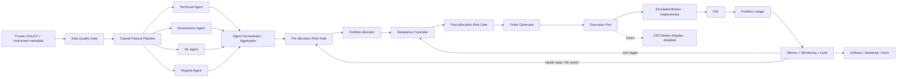

# 02 — Target architecture for all five levels

## Design objective

Build one panel-native research and backtesting system whose capabilities are progressively enabled across Levels 1–5. The architecture must also explain how a future live multi-exchange system would plug in without placing any live orders in the submitted MVP.

## Design principles

- One data clock, broker, ledger, cost model and metrics layer for every level.
- A one-symbol universe is a valid special case of the multi-asset engine.
- Completed-bar features execute at the next available open.
- Typed contracts between data, agents, risk, allocation, execution and monitoring.
- Risk controls fail closed and run both before and after allocation.
- Signal agents produce proposals; only the execution layer can create fills and alter the ledger.
- Decisions, cutoffs, constraints and failures are auditable.
- Frozen data and deterministic default execution; no API keys or LLM calls required.
- Backtest and future live operation share ports/interfaces, not duplicated business logic.

## High-level flow



## Panel-native domain model

### Market data

Canonical long-form key:

```text
(bar_start_utc, symbol)
```

Required bar fields:

```text
open, high, low, close, volume, dollar_volume,
exchange, market_type, timeframe, bar_end_utc
```

Required instrument metadata:

```text
symbol, exchange_symbol, base, quote, market_type,
first_bar_utc, last_bar_utc, status_at_download,
price_precision, amount_precision, min_notional_if_available
```

All internal functions must work for one or many symbols without a separate code path.

### Research clock

For a daily bar beginning at UTC midnight:

```text
bar t opens ────────── bar t closes
                              ↓ features become available
next bar t+1 opens → decision executes
next open-to-open interval → holding PnL
```

Store explicit fields or indexes for `feature_cutoff`, `decision_time` and `execution_time`. Never infer causal ordering from row position alone.

## Component responsibilities

### Data adapters and storage

Implemented:

- public OHLCV downloader through an exchange-neutral protocol;
- frozen processed Parquet snapshot sufficient for offline execution;
- instrument metadata and manifest with source, parameters, row counts, coverage and SHA-256;
- schema, uniqueness, OHLC sanity, missingness and coverage checks.

Forbidden:

- future volume in historical universe membership;
- silent OHLC repair;
- forward/backward filling returns or features;
- silently changing exchange/source when a download fails.

Future adapters may support other CEXs, streaming data and order books.

### Feature pipeline

Produces causal features such as:

- lagged/open-to-open and close-based returns;
- SMA/EMA ratios, RSI, MACD, normalized ATR;
- realized volatility and drawdown/range features;
- trailing volume/dollar-volume and liquidity proxies;
- cross-sectional momentum, volatility and liquidity ranks.

Any scaler, imputer, calibration step or learned transform is fit only within the historical training fold. Cross-sectional transforms at date `t` use only the eligible symbols and observations available at `t`.

### Signal agents

Agents return structured proposals, never orders.

- **TechnicalAgent** — trend/momentum state and confidence.
- **EconometricAgent** — conditional expected return and GARCH volatility; a natural score is forecast return divided by forecast risk.
- **MLAgent** — calibrated probability, expected net return or cross-sectional rank.
- **RegimeAgent** — high-volatility/risk-on/risk-off state.
- **AgentOrchestrator** — calls agents, validates cutoffs, handles abstentions/failures and records the decision trace.
- **SignalAggregator** — normalizes and combines scores using weights frozen on validation data.

Agent behavior requirements:

- `fit_cutoff <= feature_cutoff <= decision_time <= execution_time`;
- for UTC daily bars, `decision_time == execution_time` is allowed at the
  boundary where the completed bar closes exactly as the next bar opens; the
  invariant is that no position earns PnL before that next-open execution;
- finite score/confidence values;
- explicit abstention and failure reason codes;
- no side effects on portfolio state;
- per-agent contribution logged.

### Pre-allocation risk gate

Creates constraints before optimization:

- blocks stale, invalid or illiquid symbols;
- enforces current kill-switch state;
- sets maximum gross exposure and per-asset/liquidity caps;
- lowers risk budget in high-volatility regimes;
- validates model/feature cutoffs and health;
- rejects anomalous scores or agent disagreement above a configured threshold when appropriate.

Output: typed constraints, blocked symbols and reason codes.

### Portfolio allocator

Transforms approved scores and historical returns into candidate target weights.

Required methods:

- equal weight;
- inverse volatility;
- minimum variance with covariance shrinkage;
- one robust alternative such as HRP or CVaR.

All methods use the same invariants:

- long-only and no leverage;
- explicit cash weight;
- finite weights;
- sum of risky weights plus cash equals one;
- per-asset and liquidity caps;
- optional top-K/minimum score;
- turnover penalty/cap where applicable.

For Level 3, clearly state the mathematical objective of each optimizer and which validation criterion selects the submitted “optimal” method. Do not equate the maximum in-sample Sharpe with a robust optimum.

### Rebalance controller

Decides whether a candidate allocation should be executed. Inputs include:

- calendar schedule;
- drift between current and candidate weights;
- change in agent scores/confidence;
- regime/risk state;
- expected improvement net of estimated costs;
- current turnover budget.

Outputs a typed `RebalanceDecision` with trigger reasons. This is how Level 5 demonstrates AI-driven dynamic rebalancing: agent/regime changes can request a rebalance, but deterministic risk gates approve or reject it.

### Post-allocation risk gate

Validates the actual candidate target portfolio:

- weight reconciliation and finite values;
- ex-ante volatility target/cap;
- concentration, effective N and correlation exposure;
- VaR/CVaR or drawdown-risk proxy;
- gross exposure and cash;
- turnover and cost budget;
- AUM/ADV participation and capacity;
- all blocked symbols have zero weight.

It may approve, cap, fall back to prior feasible weights, or move to cash. Any fallback is explicit and logged.

### Order generation and execution

The order generator converts approved target weights to risky-asset order intents using next-open prices, current NAV, pre-trade drifted holdings, precision and minimum-notional rules where available.

`ExecutionPort` has two conceptual adapters:

- **SimulatedBroker** — implemented and used by the notebook;
- **CEXBrokerAdapter** — future disabled interface for order submission, idempotency, reconciliation and exchange filters.

The simulated broker records orders, rejects, fills, prices, timestamps, fees and slippage. Only fills can update the ledger.

### Cost model

Distinguish reporting turnover from chargeable traded notional.

```text
delta_i = target_risky_weight_i - pretrade_risky_weight_i
gross_traded_notional_fraction = sum_i(abs(delta_i))
reporting_turnover = 0.5 * (
    sum_i(abs(delta_i)) + abs(delta_cash)
)
fixed_cost_fraction = gross_traded_notional_fraction * one_way_cost_rate
```

This correctly charges two trades when rotating fully from asset A to asset B and one trade when moving from cash to an asset. Cash is included for reconciliation/turnover reporting but is not itself fee-bearing.

### Portfolio ledger

Tracks:

- cash and risky holdings;
- pre-trade and post-trade weights;
- gross and net NAV;
- realized fills and costs;
- stale/untradable holdings;
- rejected orders and forced safety actions.

Missing-bar policy must be explicit. No trade is allowed without a valid execution price. A temporary stale price may be used only for marked valuation with a stale flag and maximum age; prolonged missingness must trigger a documented freeze or conservative liquidation assumption.

### Metrics and monitoring

Trading/risk metrics:

- return, CAGR, volatility, Sharpe, Sortino, Calmar;
- maximum drawdown and duration;
- VaR/CVaR, downside deviation;
- turnover, fees/slippage, exposure, cash;
- concentration, effective N and risk contributions;
- benchmark-relative metrics.

System-quality metrics beyond trading KPIs:

- data freshness, missingness and universe coverage;
- feature/prediction drift and calibration decay;
- agent disagreement and abstention/failure rate;
- optimizer infeasibility/fallback rate;
- order rejection and reconciliation failures;
- runtime, memory, artifact freshness and hash mismatch;
- rolling out-of-sample stability and gross-to-net decay;
- kill-switch incidents and recovery status.

## Agent and safety control sequence

```text
Data Quality Gate
    ↓
Agent Orchestrator → normalized signals/confidence
    ↓
Pre-allocation Risk Gate → constraints
    ↓
Portfolio Allocator → candidate weights
    ↓
Rebalance Controller → execute/hold proposal
    ↓
Post-allocation Risk Gate → approved weights or safe fallback
    ↓
Order Generator → Simulated Broker → Fills → Ledger
    ↓
Monitoring → future health/risk/rebalance state
```

No lower layer can bypass a prior gate. Monitoring can tighten future risk or activate a kill switch, but it cannot retroactively improve results.

## Required audit trace

Every decision/rebalance row contains at least:

- bar/feature/decision/execution timestamps;
- eligible universe and exclusions;
- per-agent score, confidence, fit cutoff and reason codes;
- aggregate score and regime;
- pre-risk constraints;
- candidate and approved weights;
- rebalance trigger reasons;
- pre-trade drifted weights;
- order intents, fills, rejected orders and costs;
- post-risk status, optimizer status and kill-switch state;
- data/config/model/git hashes.

The notebook must display at least one human-readable end-to-end trace from agent outputs to final fill/no-fill decision.

## Capability reuse by level

| Level | Universe | Signals | Allocation | Rebalance | Monitoring |
|---|---|---|---|---|---|
| 1 | BTC/USDT | SMA | binary asset/cash | signal change | basic |
| 2 | BTC/USDT | technical/econometric/ML/regime ensemble | risk-scaled asset/cash | signal/risk change | model + agent health |
| 3 | cutoff-selected 5–7 | optional/no alpha required | static portfolio from prior 12 months | initial allocation only | portfolio risk |
| 4 | same 5–7 | optional signals/regime | rolling portfolio | calendar/drift/signal/risk | rebalance health |
| 5 | dynamic 100+ | pooled/cross-sectional agents | constrained top-K | weekly + signal/risk triggers | full system health |

## Future production architecture

Document but do not enable:

- streaming market data and order books;
- multiple CEX adapters and symbol normalization;
- private API keys in a secrets manager;
- order idempotency, partial fills and reconciliation;
- withdrawal-disabled exchange permissions;
- observability/alerting stack;
- Telegram read-only/admin controls with authentication;
- news/sentiment agents;
- paper trading and champion/challenger deployment.
