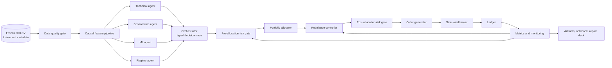
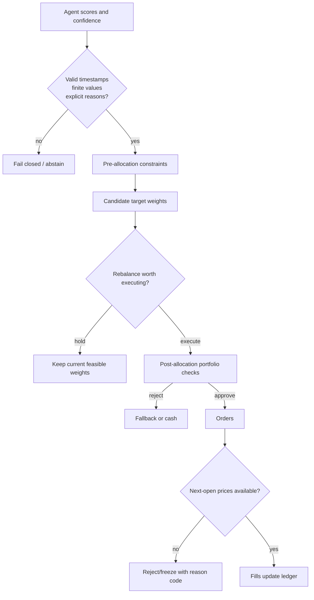
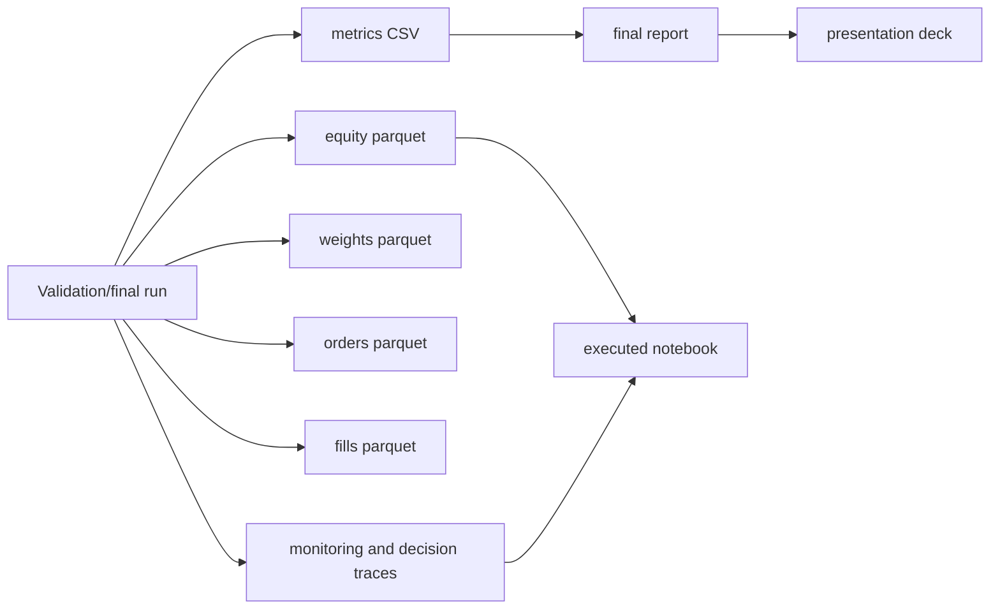

# Architecture

## Design Objective

The system is one panel-native research and backtesting architecture whose
capabilities are progressively enabled across Levels 1-5. A one-symbol run is a
special case of the multi-asset engine.

## High-Level Component Diagram



## Execution Clock

Daily bars are UTC bars timestamped by bar start. Features can use only completed
bars. Decisions execute at the next available open.

```mermaid
sequenceDiagram
    participant BarT as Bar t
    participant Feature as Feature pipeline
    participant Decision as Agents + risk + allocation
    participant Broker as Simulated broker
    participant Ledger as Ledger

    BarT->>Feature: bar t closes; completed data becomes available
    Feature->>Decision: causal features with feature_cutoff
    Decision->>Broker: target weights for next open
    Broker->>Ledger: fills at execution_time
    Ledger->>Decision: updated holdings for later rebalance decisions
```

Important invariant:

```text
fit_cutoff <= feature_cutoff <= decision_time <= execution_time
```

For daily UTC bars, `decision_time == execution_time` is acceptable at the
boundary where a completed daily bar closes exactly as the next bar opens. The
portfolio never earns PnL before that next-open execution.

## Shared Domain Model

Canonical market-data key:

```text
(bar_start_utc, symbol)
```

Required OHLCV fields include:

```text
open, high, low, close, volume, dollar_volume,
exchange, market_type, timeframe, bar_end_utc
```

Required instrument fields include:

```text
symbol, exchange_symbol, base, quote, market_type,
first_bar_utc, last_bar_utc, status_at_download,
price_precision, amount_precision, min_notional_if_available
```

All data, feature, signal, allocation, execution, and metric code supports one or
many symbols through the same APIs.

## Risk And Execution Control Flow



The pre-allocation gate restricts the feasible universe and risk budget before
optimization. The post-allocation gate validates the actual candidate portfolio.
Either gate may block trading or move to a conservative fallback.

## Agent Responsibilities

Agents emit proposals, never orders. A proposal includes score, confidence,
horizon, fit cutoff, feature cutoff, decision time, execution time, and reason
codes.

| Agent | Role |
| --- | --- |
| Technical | Trend and momentum state |
| Econometric | AutoReg expected return and GARCH volatility |
| ML | Logistic Regression and HistGradientBoosting signals |
| Regime | Volatility/risk-on/risk-off context |
| Orchestrator | Calls agents, validates cutoffs, records traces |
| Aggregator | Normalizes and combines agent scores |

## Cost Accounting

Costs are charged on risky-asset notional actually traded, not on cash as an
instrument.

```text
delta_i = target_risky_weight_i - pretrade_risky_weight_i
gross_traded_notional_fraction = sum_i(abs(delta_i))
reporting_turnover = 0.5 * (sum_i(abs(delta_i)) + abs(delta_cash))
fixed_cost_fraction = gross_traded_notional_fraction * one_way_cost_rate
```

This charges two trades when rotating from one risky asset to another, and one
trade when moving from cash into a risky asset.

## Artifact Flow



Every material artifact records or links to data/config/git hashes, period,
benchmark, cost assumptions, seed, split, and final-test lock state.
