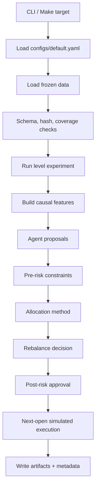
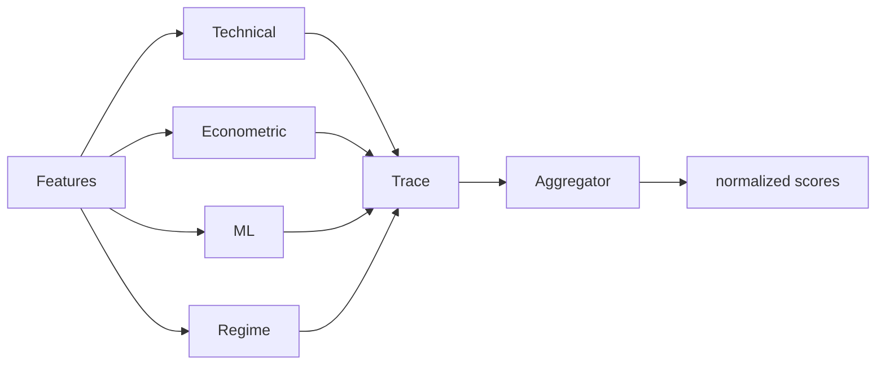

# Components And Under-The-Hood Flow

## Repository Structure

The repository is organized as a reproducible research submission rather than a
library-only package. The top-level directories separate source code, frozen
data, generated evidence, reviewer-facing outputs, and release checks.

```text
.
|-- src/crypto_hedge_fund/     Python package and reusable experiment engine
|-- configs/                   Frozen and fast-run YAML configurations
|-- data/                      Included offline data snapshot and manifests
|-- artifacts/                 Metrics, ledgers, traces, proofs, and final-test outputs
|-- notebooks/                 Executed end-to-end reviewer notebook
|-- reports/                   Final report, data card, and model cards
|-- presentation/              Final defense deck PDF
|-- docs/                      Public documentation set
|-- scripts/                   Small command-line helpers used by Make targets
|-- tests/                     Unit and release-contract tests
|-- Makefile                   Stable review and reproducibility commands
|-- pyproject.toml             Python package, dependency, and tool configuration
`-- uv.lock                    Locked dependency resolution
```

Important top-level files:

| Path | Purpose |
| --- | --- |
| `README.md` | Release-facing quick start, final results, and limitations. |
| `AGENTS.md` | Repository working contract for maintenance agents. |
| `LICENSE` | MIT project license. |
| `THIRD_PARTY_LICENSES.md` | Dependency and reference-project license notes. |

The committed public surface intentionally excludes internal prompt files, stage
logs, scratch audits, and handoff notes. The retained tree is meant to let a
reviewer reproduce the run and inspect the evidence without private process
material.

## Package Map

| Package | Main responsibility |
| --- | --- |
| `crypto_hedge_fund.data` | storage, schema checks, universe eligibility, optional download |
| `crypto_hedge_fund.features` | causal technical and cross-sectional features |
| `crypto_hedge_fund.models` | econometric and classical ML model helpers |
| `crypto_hedge_fund.agents` | typed signal agents, orchestration, aggregation |
| `crypto_hedge_fund.risk` | pre-allocation and post-allocation risk gates |
| `crypto_hedge_fund.portfolio` | equal-weight, inverse-vol, min-var, robust allocation and rebalance policy |
| `crypto_hedge_fund.execution` | order generation, simulated broker, cost model, ledger |
| `crypto_hedge_fund.metrics` | performance, drawdown, turnover, exposure, benchmark metrics |
| `crypto_hedge_fund.monitoring` | traces, alerts, health summaries |
| `crypto_hedge_fund.experiments` | Level 1-5 validation and final-test runners |
| `crypto_hedge_fund.reporting` | notebook, report, and presentation builders |
| `crypto_hedge_fund.pretest_lock` | final-test lock validation and provenance checks |

## Source Package Structure

The package follows the same sequence as the trading pipeline. Each assignment
level calls into these shared modules instead of owning a separate stack.

```text
src/crypto_hedge_fund/
|-- cli.py                     Command entry points used by Make targets
|-- config.py                  YAML loading and typed runtime configuration
|-- clock.py                   UTC trading-clock helpers
|-- types.py                   Shared typed records for signals, risk, and traces
|-- provenance.py              Git, config, data, and artifact provenance helpers
|-- pretest_lock.py            Final-test lock creation and verification
|-- data/                      Frozen data access, schemas, validation, universe rules
|-- features/                  Causal feature builders for Level 2 and Level 5
|-- models/                    Econometric and classical ML model helpers
|-- strategies/                SMA baseline signal logic
|-- agents/                    Typed signal agents, aggregation, orchestration
|-- risk/                      Pre-allocation and post-allocation controls
|-- portfolio/                 Allocators and rebalance policies
|-- execution/                 Panel data adapter, broker, cost model, ledger
|-- metrics/                   Performance and benchmark metrics
|-- monitoring/                Decision traces, alerts, and health summaries
|-- artifacts/                 Artifact and metadata writers
|-- experiments/               Level 1-5 validation and frozen final-test runners
`-- reporting/                 Notebook, report, and presentation builders
```

Level-specific code lives under `experiments/`, but the durable behavior lives
in shared modules. For example, Level 1 still uses the same execution, ledger,
cost, risk, metrics, and artifact modules as the large-universe Level 5 run.

## End-To-End Runtime Flow



The CLI is thin. The reusable logic lives in package modules and is exercised by
unit tests.

## Data Layer

Key files:

- `data/storage.py` reads the frozen Parquet snapshot.
- `data/validation.py` verifies schema, hashes, uniqueness, OHLC consistency, and
  coverage.
- `data/universe.py` determines eligible symbols at a decision cutoff.
- `data/download.py` is a supplementary public-data refresh path, not required for
  the default final run.

The default release path is offline. It does not need exchange credentials or a
live data download.

## Signal Layer

Level 2 and higher use typed signal records. Each agent is required to report
what it knew, when it knew it, and why it produced or withheld a score.



The aggregation layer is intentionally separated from execution. A strong signal
can still be blocked by risk, capacity, missing prices, or cost-aware rebalance
logic.

## Allocation And Rebalancing

The allocator transforms approved scores and historical returns into target
weights. The rebalance controller decides whether changing from current weights to
candidate weights is justified.

Rebalance triggers can include:

- calendar schedule;
- drift from target weights;
- score or confidence changes;
- regime changes;
- risk-state changes;
- expected improvement net of estimated costs.

## Execution And Ledger

Execution is simulated through the shared broker and ledger:

1. Target weights are converted into risky-asset order intents.
2. Orders require valid next-open prices for traded or held symbols.
3. Fees and slippage are charged on risky traded notional.
4. Fills, not signals, update cash and holdings.
5. The ledger records NAV, weights, costs, rejected orders, and stale-price state.

Missing execution prices fail closed. Valuation may use a temporary stale mark only
when explicitly flagged and bounded by policy.

## Reporting Layer

The reporting builders read committed artifacts and render or verify:

- `notebooks/ai_crypto_hedge_fund.ipynb`;
- `reports/final_report.md`;
- `presentation/AI Crypto Hedge Fund - Defense Deck.pdf`.

The full notebook is persisted with outputs and deterministic cell IDs, so
`make notebook-full` is idempotent.
