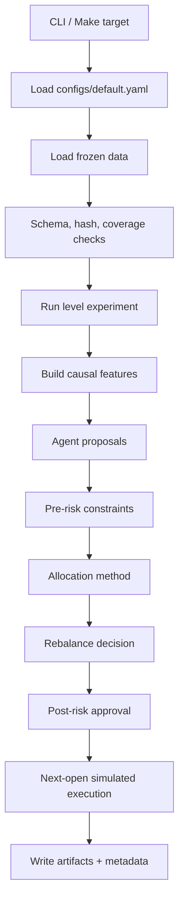
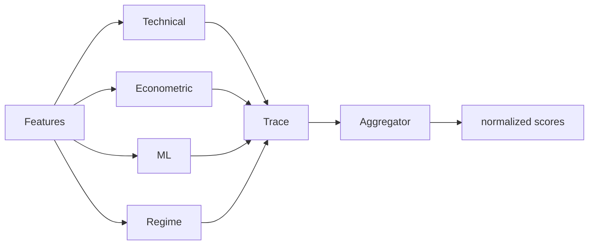

# Components And Under-The-Hood Flow

## Package Map

| Package | Main responsibility |
| --- | --- |
| `crypto_hedge_fund.data` | storage, schema checks, universe eligibility, optional download |
| `crypto_hedge_fund.features` | causal technical and cross-sectional features |
| `crypto_hedge_fund.models` | econometric and classical ML model helpers |
| `crypto_hedge_fund.agents` | typed signal agents, orchestration, aggregation |
| `crypto_hedge_fund.risk` | pre-allocation and post-allocation risk gates |
| `crypto_hedge_fund.portfolio` | equal-weight, inverse-vol, min-var, robust allocation and rebalance policy |
| `crypto_hedge_fund.execution` | order generation, simulated broker, cost model, ledger |
| `crypto_hedge_fund.metrics` | performance, drawdown, turnover, exposure, benchmark metrics |
| `crypto_hedge_fund.monitoring` | traces, alerts, health summaries |
| `crypto_hedge_fund.experiments` | Level 1-5 validation and final-test runners |
| `crypto_hedge_fund.reporting` | notebook, report, and presentation builders |
| `crypto_hedge_fund.pretest_lock` | final-test lock validation and provenance checks |

## End-To-End Runtime Flow

The CLI is thin. The reusable logic lives in package modules and is exercised by
unit tests.

## Data Layer

Key files:

- `data/storage.py` reads the frozen Parquet snapshot.
- `data/validation.py` verifies schema, hashes, uniqueness, OHLC consistency, and
  coverage.
- `data/universe.py` determines eligible symbols at a decision cutoff.
- `data/download.py` is a supplementary public-data refresh path, not required for
  the default final run.

The default release path is offline. It does not need exchange credentials or a
live data download.

## Signal Layer

Level 2 and higher use typed signal records. Each agent is required to report
what it knew, when it knew it, and why it produced or withheld a score.

The aggregation layer is intentionally separated from execution. A strong signal
can still be blocked by risk, capacity, missing prices, or cost-aware rebalance
logic.

## Allocation And Rebalancing

The allocator transforms approved scores and historical returns into target
weights. The rebalance controller decides whether changing from current weights to
candidate weights is justified.

Rebalance triggers can include:

- calendar schedule;
- drift from target weights;
- score or confidence changes;
- regime changes;
- risk-state changes;
- expected improvement net of estimated costs.

## Execution And Ledger

Execution is simulated through the shared broker and ledger:

1. Target weights are converted into risky-asset order intents.
2. Orders require valid next-open prices for traded or held symbols.
3. Fees and slippage are charged on risky traded notional.
4. Fills, not signals, update cash and holdings.
5. The ledger records NAV, weights, costs, rejected orders, and stale-price state.

Missing execution prices fail closed. Valuation may use a temporary stale mark only
when explicitly flagged and bounded by policy.

## Reporting Layer

The reporting builders read committed artifacts and render:

- `notebooks/ai_crypto_hedge_fund.ipynb`;
- `reports/final_report.md`;
- `presentation/deck.md`;
- `presentation/deck.pdf`.

The full notebook is persisted with outputs and deterministic cell IDs, so
`make notebook-full` is idempotent.
