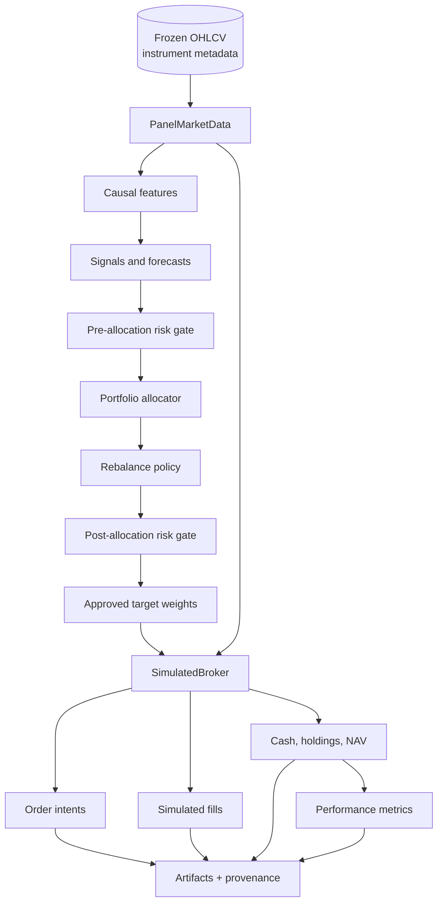
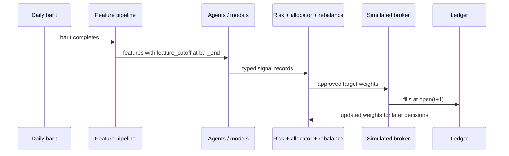
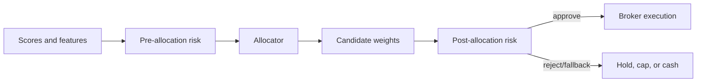

# Backtesting

## Purpose

Backtesting in this repository is the historical simulation layer that converts
research decisions into simulated orders, fills, ledger states, metrics, and
reviewable artifacts. It is an offline research system. It is not a live trading
bot, does not submit exchange orders, and does not claim future profitability.

The design goal is one shared execution architecture for all assignment levels.
Level 1 is a one-symbol configuration of the same broker, ledger, cost model,
metrics, and artifact flow used by the multi-asset levels.

## Main Source Files

| File | Responsibility |
| --- | --- |
| `src/crypto_hedge_fund/execution/panel.py` | Validates panel OHLCV data and serves open prices for execution and valuation. |
| `src/crypto_hedge_fund/execution/broker.py` | Runs the next-open simulated broker and in-memory ledger. |
| `src/crypto_hedge_fund/execution/costs.py` | Estimates costs and turnover from risky-weight changes. |
| `src/crypto_hedge_fund/portfolio/rebalance.py` | Decides whether a candidate target portfolio should be traded. |
| `src/crypto_hedge_fund/risk/pre_allocation.py` | Applies feasible-universe and risk constraints before allocation. |
| `src/crypto_hedge_fund/risk/post_allocation.py` | Validates or blocks candidate portfolios after allocation. |
| `src/crypto_hedge_fund/metrics/performance.py` | Computes return, risk, drawdown, turnover, exposure, and benchmark metrics. |
| `src/crypto_hedge_fund/artifacts/writers.py` | Writes metrics, equity, weights, orders, fills, and provenance metadata. |
| `src/crypto_hedge_fund/experiments/level_*.py` | Level-specific runners that build signals and target weights, then call the shared execution kernel. |

## High-Level Flow



Signal agents and models never mutate portfolio state. They only emit typed
scores, probabilities, expected returns, confidence values, horizons, cutoffs,
and reason codes. The broker is the only component that updates cash and
holdings, and it does so only from approved target weights.

## Execution Clock

Daily candles are UTC bars timestamped by `bar_start_utc`. A decision for bar
`t` is allowed to use only data from the completed bar. Execution happens at the
next available open.



The required causal ordering is:

```text
fit_cutoff <= feature_cutoff <= decision_time <= execution_time
```

For daily UTC data, the end of one bar and the open of the next bar occur at the
same timestamp. This is still next-open execution because the portfolio does not
receive the execution price until the completed bar is available and the next
bar opens. The simulation never assumes that a strategy can decide after
`close(t)` and still trade at that same completed close.

## Panel Market Data

The execution layer consumes long-form OHLCV data keyed by:

```text
(bar_start_utc, symbol)
```

`PanelMarketData` validates that required fields exist, timestamps are UTC,
symbols are unique per timestamp, and `open` and `close` prices are finite and
positive. During execution and valuation, the broker requests open prices for
all traded or currently held symbols.

If a required execution open is missing, the system fails closed with an explicit
error instead of silently forward-filling an entry price. This protects the
backtest from accidental trades at unavailable prices.

## Target Weights

The broker receives a target-weight schedule, not direct orders. Each row is a
decision bar and each symbol column is the desired risky-asset portfolio weight.
Cash is implicit:

```text
cash_weight = 1 - sum(risky_asset_weights)
```

Example:

```text
bar_start_utc        BTC/USDT   ETH/USDT
2024-01-01 00:00    0.50       0.30
2024-01-02 00:00    0.40       0.40
```

The first row means:

```text
After the 2024-01-01 daily bar is complete,
target 50% BTC, 30% ETH, and 20% USDT cash,
then execute at the next available open.
```

Target risky weights must be finite, non-negative under the long-only mandate,
and must not imply leverage. Invalid target weights are rejected before
execution.

## Broker And Ledger

`SimulatedBroker.run()` is the shared execution kernel. For every available open
timestamp in the simulation window, it performs the following steps:

1. Determine whether a target-weight decision is scheduled for that timestamp.
2. Load valid open prices for all traded and currently held symbols.
3. Mark current holdings to market and compute pre-trade NAV.
4. Compare current risky weights with target risky weights.
5. Generate sell orders for assets whose target value decreased.
6. Generate buy orders for assets whose target value increased.
7. Charge fees and slippage on risky traded notional.
8. Update cash and asset quantities from fills.
9. Mark the updated portfolio to market.
10. Record equity, weights, orders, fills, costs, exposure, and trade count.

The ledger state is intentionally simple:

```text
cash
holdings by symbol
open prices
NAV = cash + sum(quantity_i * open_price_i)
```

Only fills update cash and holdings. Signals, forecasts, and target weights do
not directly alter the ledger.

## Cost Model

Costs are charged on risky-asset notional actually traded. Cash is not treated
as a fee-bearing instrument.

For a portfolio value `V`:

```text
delta_i = target_risky_weight_i - pretrade_risky_weight_i
traded_notional = V * sum_i(abs(delta_i))
cost = traded_notional * (fee_bps + slippage_bps) / 10,000
```

Moving from cash into one asset is a one-sided trade. Rotating from asset A to
asset B is two-sided because the simulation sells A and buys B.

Example:

```text
Portfolio NAV:              1,000,000 USDT
Old BTC weight:             50%
New BTC weight:             30%
Traded notional:            200,000 USDT
Fee + slippage:             15 bps = 0.15%
Cost:                       200,000 * 0.0015 = 300 USDT
```

After the sell, cash increases by the sold notional minus the cost. For buys,
cash decreases by the bought notional plus the cost. The broker rejects trades
that would require more cash than is available after costs.

## Rebalancing

The backtest does not have to trade every time a model changes its score. The
rebalance layer decides whether the candidate target portfolio should be sent to
the broker.

Depending on the level, rebalance triggers can include:

- a fixed calendar schedule;
- drift from the current target weights;
- changes in signal score or confidence;
- changes in regime or risk state;
- expected improvement after estimated transaction costs;
- risk-triggered moves toward cash.

Level 1 and Level 2 use simple always-rebalance configurations for their narrow
experiments. Higher levels add dynamic rebalance rules to reduce unnecessary
turnover and to make cost-aware decisions.

## Risk Gates

The execution path has two risk stages.

Pre-allocation risk runs before the optimizer or allocator. It can remove assets
from the feasible universe, cap exposure, block missing or stale data, enforce
liquidity constraints, or set portfolio-level limits.

Post-allocation risk runs after a candidate target portfolio exists. It checks
whether the actual proposed weights are acceptable. It can approve the target,
reject it, freeze current weights, cap exposure, or move the portfolio to cash.



This separation matters because an asset can look attractive as a signal but
still be blocked because of missing prices, liquidity, portfolio concentration,
volatility, drawdown state, or excessive expected turnover.

## Outputs

Each backtest run produces an in-memory `BacktestRunResult` with:

| Output | Meaning |
| --- | --- |
| `equity` | Daily portfolio ledger rows: cash, risky value, NAV, turnover, fees, slippage, exposure, trade count. |
| `weights` | Realized portfolio weights after execution and valuation. |
| `orders` | Simulated order intents created from target-weight deltas. |
| `fills` | Simulated executions that update cash and holdings. |

The artifact writer persists these outputs under:

```text
artifacts/metrics/level_*.csv
artifacts/equity/level_*.parquet
artifacts/weights/level_*.parquet
artifacts/orders/level_*.parquet
artifacts/fills/level_*.parquet
artifacts/figures/level_*.png
artifacts/monitoring/
```

Every material artifact includes provenance metadata such as level, run label,
split, period, benchmark, cost assumptions, seed, data hash, config hash, git
commit, and final-test lock state when applicable.

## Metrics

Trading metrics are computed from the ledger and benchmark series, not directly
from model scores. Reported metrics include:

- total return and ROI;
- CAGR;
- volatility;
- Sharpe and Sortino;
- Calmar ratio;
- maximum drawdown and drawdown duration;
- VaR and CVaR;
- turnover;
- average exposure and cash exposure;
- trade count;
- fees, slippage, and total cost;
- benchmark return and excess return;
- tracking error and information ratio.

Net metrics after fees and slippage are the primary reported results. Gross
variants are kept only to show the effect of transaction costs.

## Level Usage

All levels use the same execution principles.

| Level | What changes before execution | What stays shared |
| --- | --- | --- |
| Level 1 | BTC/USDT SMA target schedule. | Broker, ledger, costs, metrics, artifacts. |
| Level 2 | Typed technical, econometric, ML, regime, and ensemble signals. | Next-open execution and target-weight broker. |
| Level 3 | Small multi-asset portfolio allocation. | Panel-native open prices, costs, NAV, orders, fills. |
| Level 4 | Dynamic rebalance policy and rebalance log. | Same ledger and simulated broker. |
| Level 5 | Large-universe eligibility, scoring, and top-selection workflow. | Same risk, allocation, execution, and artifact contracts. |

This is why the project describes the levels as increasing portfolio complexity
on one architecture, rather than five separate systems.

## Minimal Numerical Example

Assume:

```text
Initial cash:                 1,000,000 USDT
Current holdings:             none
Target at next open:          BTC weight = 50%
BTC open price:               50,000 USDT
Fee + slippage:               15 bps
```

The broker computes:

```text
target_notional = 1,000,000 * 0.50 = 500,000
cost = 500,000 * 0.0015 = 750
quantity = 500,000 / 50,000 = 10 BTC
cash_after = 1,000,000 - 500,000 - 750 = 499,250
```

The ledger then records:

```text
BTC holdings:                 10 BTC
cash:                         499,250 USDT
risky value at entry open:    500,000 USDT
NAV after costs:              999,250 USDT
total cost:                   750 USDT
exposure:                     about 50.04% of post-cost NAV
```

On the next valuation timestamp, NAV changes only because open prices changed or
because a new approved rebalance was executed. This keeps model predictions,
portfolio decisions, execution, costs, and ledger valuation separated and
auditable.
