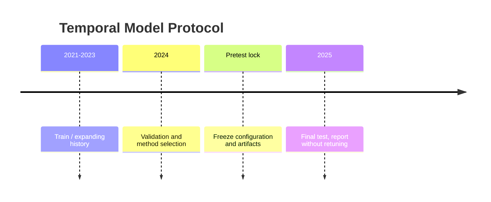
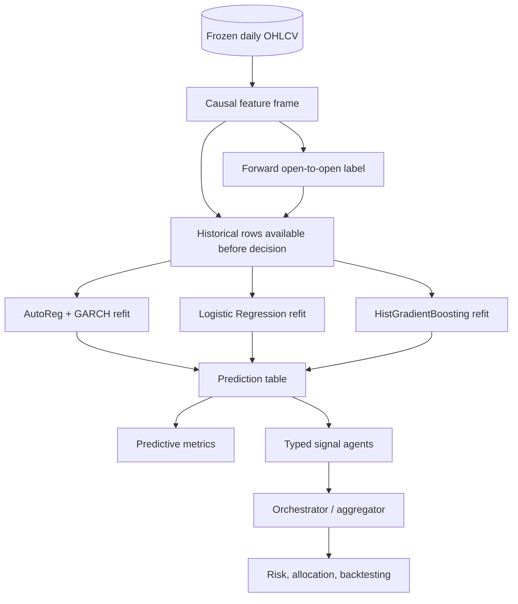
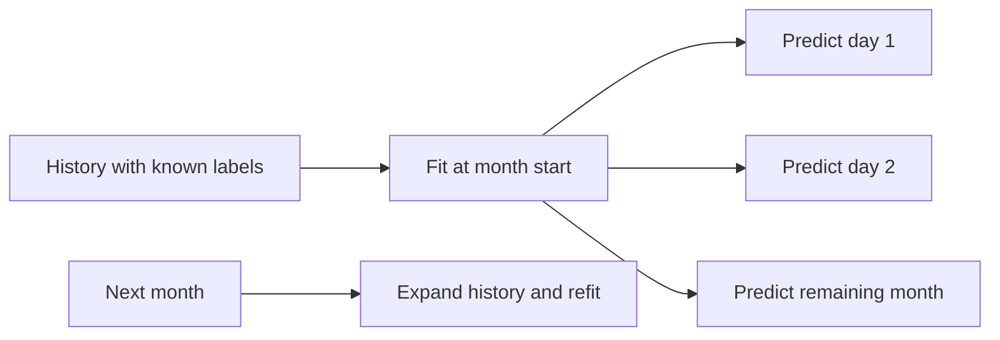
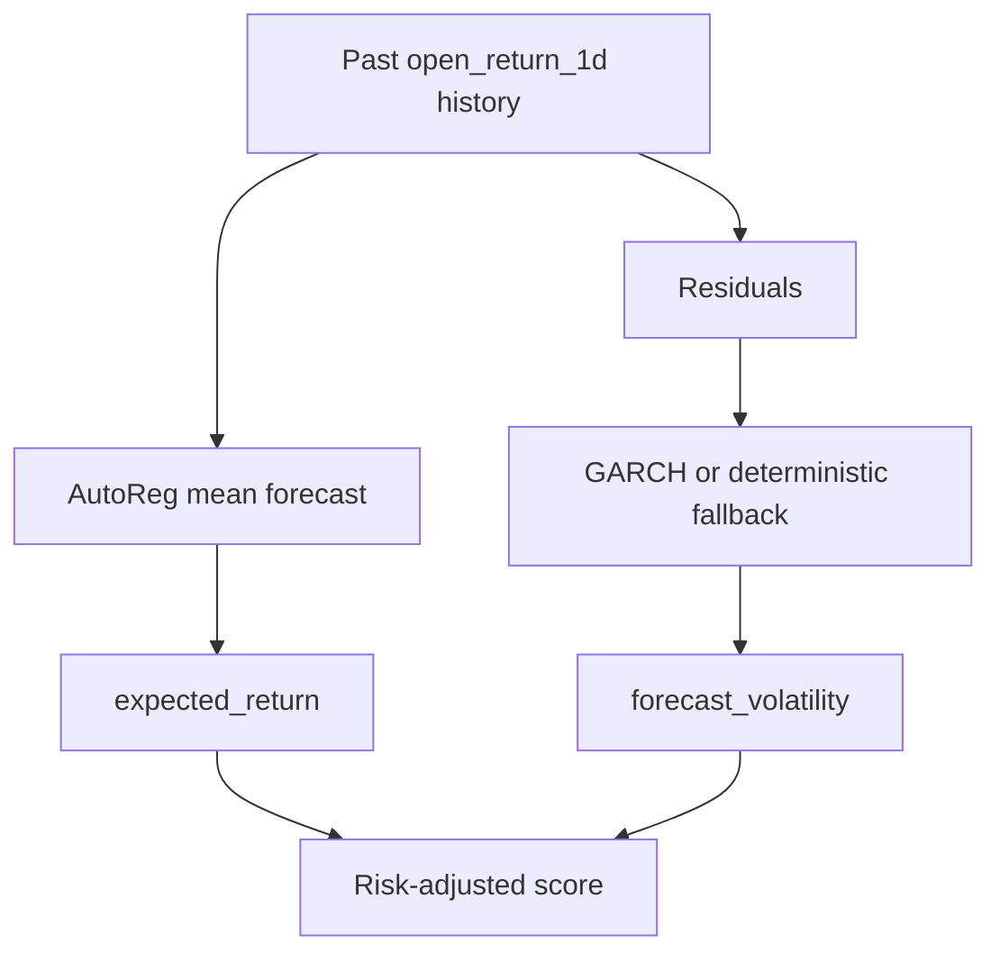
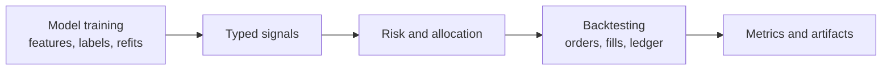

# Model Training

## Purpose

Model training in this repository is the process that turns completed historical
bars into causal forecasts, typed agent signals, predictive diagnostics, and
frozen model-selection evidence. It is deliberately separated from portfolio
execution. A trained model can emit a strong score, but that score can still be
blocked by risk controls, rebalancing rules, missing prices, or transaction
costs.

The project uses classical, reproducible models rather than external LLMs or
live services:

- technical feature rules;
- AutoReg expected-return forecasting;
- GARCH-style conditional-volatility forecasting;
- Logistic Regression;
- HistGradientBoostingClassifier;
- deterministic large-universe scoring for Level 5.

No default run requires exchange credentials, paid APIs, live downloads, or a
remote model service.

## Main Source Files

| File | Responsibility |
| --- | --- |
| `src/crypto_hedge_fund/features/level2.py` | Builds Level 2 causal features, forward returns, labels, and label observation timestamps. |
| `src/crypto_hedge_fund/models/ml.py` | Runs walk-forward Logistic Regression and HistGradientBoosting predictions. |
| `src/crypto_hedge_fund/models/econometric.py` | Fits AutoReg expected-return and GARCH-style volatility forecasts. |
| `src/crypto_hedge_fund/experiments/level_2.py` | Coordinates Level 2 feature building, walk-forward prediction, agent signals, trading, and artifacts. |
| `src/crypto_hedge_fund/features/level5.py` | Builds deterministic large-universe ranking features and scores. |
| `src/crypto_hedge_fund/pretest_lock.py` | Freezes selected methods before final-test exposure. |
| `reports/model_cards/` | Documents model responsibilities, cutoffs, metrics, and risks. |

## Implementation Map

The model-training functionality is implemented in the following code and
documentation files.

| Area | File | What to look for |
| --- | --- | --- |
| Level 2 feature and target construction | [`src/crypto_hedge_fund/features/level2.py`](../src/crypto_hedge_fund/features/level2.py) | `LEVEL2_FEATURE_COLUMNS` defines the 20 causal features. `build_level2_feature_frame()` computes completed-bar features, next-open `forward_return`, `target_label`, `execution_time`, `feature_cutoff`, and `label_observation_time`. |
| Walk-forward ML training | [`src/crypto_hedge_fund/models/ml.py`](../src/crypto_hedge_fund/models/ml.py) | `walk_forward_ml_predictions()` coordinates validation predictions. `_predict_one_seed()` performs expanding-window training and prevents future-label leakage with `label_observation_time < first_execution`. |
| ML model pipelines | [`src/crypto_hedge_fund/models/ml.py`](../src/crypto_hedge_fund/models/ml.py) | `_pipeline()` builds the Logistic Regression pipeline with median imputation, scaling, and balanced class weights, and the HistGradientBoosting pipeline with fixed parameters. |
| Predictive ML metrics | [`src/crypto_hedge_fund/models/ml.py`](../src/crypto_hedge_fund/models/ml.py) | `predictive_metrics()` computes log loss, Brier score, positive rate, ROC-AUC, PR-AUC, precision, recall, and calibration MAE. |
| Econometric forecasting | [`src/crypto_hedge_fund/models/econometric.py`](../src/crypto_hedge_fund/models/econometric.py) | `fit_econometric_forecast()` combines AutoReg expected-return forecasting with GARCH-style volatility forecasting and explicit abstention rules. |
| AutoReg mean forecast | [`src/crypto_hedge_fund/models/econometric.py`](../src/crypto_hedge_fund/models/econometric.py) | `_autoregressive_mean()` chooses a bounded lag count and forecasts the next return from lagged historical returns. |
| GARCH volatility forecast | [`src/crypto_hedge_fund/models/econometric.py`](../src/crypto_hedge_fund/models/econometric.py) | `_garch_volatility()` attempts `arch` GARCH(1,1), then falls back to `_educational_garch_fallback()` for deterministic reproducibility. |
| Level 2 training orchestration | [`src/crypto_hedge_fund/experiments/level_2.py`](../src/crypto_hedge_fund/experiments/level_2.py) | `run_level_2_validation()` builds features, defines validation masks, launches ML predictions, launches econometric predictions, and passes prediction tables into typed agents. |
| Econometric walk-forward predictions | [`src/crypto_hedge_fund/experiments/level_2.py`](../src/crypto_hedge_fund/experiments/level_2.py) | `_econometric_predictions()` refits the AutoReg/GARCH forecast for each validation decision using only label-observable history. |
| Predictive artifact writing | [`src/crypto_hedge_fund/experiments/level_2.py`](../src/crypto_hedge_fund/experiments/level_2.py) | `_write_prediction_artifacts()` writes model prediction and fit-audit outputs, including `train_samples`, `fit_cutoff`, `refit_frequency`, and `used_future_labels`. |
| Typed signal emission from prediction tables | [`src/crypto_hedge_fund/agents/level2.py`](../src/crypto_hedge_fund/agents/level2.py) | `PredictionTableSignalAgent` converts precomputed causal predictions into `AgentSignal` records with score, confidence, cutoffs, reason codes, and metadata. |
| Signal orchestration and aggregation | [`src/crypto_hedge_fund/agents/orchestrator.py`](../src/crypto_hedge_fund/agents/orchestrator.py) | The orchestrator calls agents, validates signal records, and builds decision traces before risk and allocation. |
| Level 5 deterministic scoring | [`src/crypto_hedge_fund/features/level5.py`](../src/crypto_hedge_fund/features/level5.py) | Builds large-universe ranking features, realized volatility, liquidity features, deterministic scores, confidence, and data-quality flags. |
| Frozen method lock | [`src/crypto_hedge_fund/pretest_lock.py`](../src/crypto_hedge_fund/pretest_lock.py) | `build_pretest_lock()` records selected methods, model/refit choices, constraints, and final-test quarantine evidence before final-test exposure. |
| Final-test execution with frozen choices | [`src/crypto_hedge_fund/experiments/final_test.py`](../src/crypto_hedge_fund/experiments/final_test.py) | `run_frozen_final_test()` validates the lock and runs the frozen Level 1-5 configuration without retuning. |
| ML model card | [`reports/model_cards/ml_agent.md`](../reports/model_cards/ml_agent.md) | Reader-facing responsibility, features, target, fit schedule, cutoffs, validation, confidence, metrics, and risks for ML agents. |
| Econometric model card | [`reports/model_cards/econometric_agent.md`](../reports/model_cards/econometric_agent.md) | Reader-facing responsibility, features, AutoReg/GARCH target, fit schedule, cutoffs, abstention, metrics, and risks for the econometric agent. |
| Experiment protocol | [`docs/05_EXPERIMENT_PROTOCOL.md`](05_EXPERIMENT_PROTOCOL.md) | High-level train/validation/final-test protocol, no-leakage rules, and level-specific modeling methods. |

## Split Discipline

The default split discipline is temporal:

```text
Train:       2021-01-01 through 2023-12-31
Validation: 2024-01-01 through 2024-12-31
Final test: 2025-01-01 through 2025-12-31
```

The final-test period is quarantined. Model families, thresholds, selected
assets, risk limits, ensemble weights, rebalance policy, benchmark definitions,
and cost assumptions must be selected before final-test exposure.



No shuffled split is used. The project treats time ordering as part of the
method, not as a convenience setting.

## Training And Prediction Flow



The prediction table is the bridge between model training and trading
simulation. It records what the model knew, when the fit was allowed to observe
labels, what probability or score it emitted, and whether it abstained.

## Feature Construction

Level 2 builds one row per completed BTC/USDT daily bar. The feature set is
causal: each row uses only information available when the daily bar is complete.

Feature groups include:

- one-day open and close returns;
- 5, 10, and 20-day momentum;
- SMA and EMA trend ratios;
- RSI and MACD;
- normalized ATR and daily range;
- 7, 20, and 60-day realized volatility;
- close-to-open and gap returns;
- rolling drawdown;
- volume and dollar-volume z-scores.

## Training Feature List

Level 2 ML models train on the following 20 causal features from
`LEVEL2_FEATURE_COLUMNS`.

| Feature | Group | What it measures |
| --- | --- | --- |
| `open_return_1d` | Short return | One-day open-to-open return: `Open_t / Open_{t-1} - 1`. It captures the latest direction on the execution-aligned price series. |
| `close_return_1d` | Short return | One-day close-to-close return: `Close_t / Close_{t-1} - 1`. It captures the latest completed candle direction. |
| `return_5d` | Momentum | Five-day close momentum: `Close_t / Close_{t-5} - 1`. It measures short-term trend persistence. |
| `return_10d` | Momentum | Ten-day close momentum. It smooths the very short-term noise more than `return_5d`. |
| `return_20d` | Momentum | Twenty-day close momentum. It approximates a one-month trend signal on daily crypto bars. |
| `sma_ratio_10_50` | Trend ratio | Ratio of 10-day SMA to 50-day SMA minus one. Positive values mean the short moving average is above the longer moving average. |
| `ema_ratio_12_26` | Trend ratio | Ratio of 12-day EMA to 26-day EMA minus one. Positive values indicate shorter-term trend strength relative to the slower EMA. |
| `rsi_14` | Oscillator | RSI over 14 days, normalized to `[0, 1]`. Higher values mean recent gains dominate recent losses. |
| `macd` | MACD | Difference between 12-day EMA and 26-day EMA, divided by close. It measures trend acceleration in price-normalized form. |
| `macd_signal` | MACD | EMA-smoothed MACD signal line, divided by close. It smooths the raw MACD trend signal. |
| `atr_14_norm` | Range / risk | 14-day Average True Range divided by close. It measures recent candle range and gap risk relative to price. |
| `realized_vol_7` | Realized volatility | Annualized standard deviation of close returns over 7 days. It captures the very recent volatility regime. |
| `realized_vol_20` | Realized volatility | Annualized standard deviation of close returns over 20 days. It captures roughly one-month realized volatility. |
| `realized_vol_60` | Realized volatility | Annualized standard deviation of close returns over 60 days. It captures a slower volatility regime. |
| `range_norm` | Range / risk | Daily high-low range divided by close: `(High_t - Low_t) / Close_t`. It measures intraday dispersion. |
| `close_open_return` | Candle body | Within-candle return: `Close_t / Open_t - 1`. It shows whether the completed day closed stronger or weaker than it opened. |
| `gap_return` | Gap | Opening gap from previous close: `Open_t / Close_{t-1} - 1`. It captures overnight/session-boundary movement. |
| `drawdown_60` | Drawdown | Current close divided by the rolling 60-day high minus one. Values are usually `<= 0` and show distance from the recent peak. |
| `volume_z_20` | Liquidity / activity | 20-day z-score of base volume. It identifies unusually high or low trading activity. |
| `dollar_volume_z_20` | Liquidity / activity | 20-day z-score of dollar volume. It identifies unusual notional turnover in USDT terms. |

All of these features are computed from completed bars only. They are available
at `feature_cutoff` and are used to predict the next open-to-open target, not the
same bar's close.

The feature frame also stores timestamp fields used for leakage checks:

| Field | Meaning |
| --- | --- |
| `bar_start_utc` | Start of the completed daily candle. |
| `bar_end_utc` | End of that candle. |
| `feature_cutoff` | Latest time the feature row is allowed to know. |
| `execution_time` | Next-open time used for simulated execution. |
| `future_open_time` | Time when the forward return becomes observable. |
| `label_observation_time` | Same target-availability timestamp used to block future-label leakage. |

## Target Definition

The supervised target is based on next-open execution and the following
open-to-open return:

```text
forward_return_t = Open(t+2) / Open(t+1) - 1
target_label_t = 1[forward_return_t > threshold_return]
```

In the frozen protocol, the positive threshold includes a cost and safety margin.
For example, with a `0.20%` threshold:

```text
Open(t+1) = 100.00
Open(t+2) = 100.50
forward_return = 100.50 / 100.00 - 1 = 0.50%
target_label = 1
```

If the forward return is only `0.10%`, the label is `0` because it does not clear
the threshold.

The target is intentionally not the same-bar close. The decision is made after a
bar is complete, so trading at the just-observed close would be a look-ahead
execution assumption.

## Walk-Forward ML Training

The ML training path lives in `walk_forward_ml_predictions`. It creates
validation-period predictions by repeatedly fitting models on an expanding
history.

For each validation group:

1. Sort validation rows by `execution_time`.
2. Find the first execution time in the group.
3. Select only rows whose `label_observation_time` is strictly before that first
   execution time.
4. Drop rows with missing features or missing labels.
5. Fit the model if there are enough samples and both classes are present.
6. Emit probabilities, scores, confidence values, fit cutoffs, and audit rows.

The key anti-leakage condition is:

```text
training_row.label_observation_time < prediction_execution_time
```

This means the model cannot train on a label whose forward return would only
become known after the prediction is supposed to be made.

## Refit Cadence

The validation-selected ML cadence is monthly expanding refit.

```text
ml_default_retrain: monthly
min_train_samples: 120
```

For monthly refit, all prediction rows in the same execution month share one
fitted pipeline. The pipeline is trained only on labels observable before the
first execution in that month.



Daily refit is supported by the helper, but the frozen selected ML cadence is
monthly.

## ML Model Families

Two classical classifiers are trained and compared.

| Model | Pipeline |
| --- | --- |
| Logistic Regression | Median imputation, standard scaling, balanced class weights, logistic classifier. |
| HistGradientBoostingClassifier | Median imputation and histogram gradient boosting with fixed tree parameters. |

The Logistic Regression model is interpretable and linear after feature scaling.
The HistGradientBoosting model can capture nonlinear feature interactions, but
it also has higher overfitting risk on noisy daily crypto data.

The ML output probability is converted into a normalized agent signal:

```text
score = clip((probability - 0.5) * 2, -1, 1)
confidence = abs(probability - 0.5) * 2
```

Examples:

```text
probability = 0.50 -> score = 0.00, confidence = 0.00
probability = 0.65 -> score = 0.30, confidence = 0.30
probability = 0.20 -> score = -0.60, confidence = 0.60
```

The probabilities are raw model probabilities. The project measures calibration
error, but it does not fit a separate Platt, sigmoid, or isotonic calibrator in
the frozen protocol.

## Econometric Training

The econometric path is not a classifier pipeline. It refits a return model for
each validation decision using historical open-to-open returns.



The model has two outputs:

```text
expected_return      one-step return forecast
forecast_volatility  one-step conditional volatility forecast
```

The signal is risk-adjusted:

```text
risk_adjusted = expected_return / forecast_volatility
score = tanh(risk_adjusted * 3.0)
confidence = min(1.0, abs(risk_adjusted) * 4.0)
```

AutoReg uses lagged returns for the mean forecast. The helper allows up to five
lags and reduces the effective lag count when history is short:

```text
lags = min(5, max(1, len(returns) // 40))
```

The volatility forecast first attempts a GARCH(1,1) fit through `arch`. If that
fit is unavailable or fails, the code falls back to a deterministic
GARCH-style EWMA recursion. This keeps the default run reproducible and avoids
silently dropping the econometric signal path.

## Abstention Rules

Models are allowed to withhold a score. This is preferable to emitting an
unreliable forecast as if it were valid.

The ML path abstains when:

- available training samples are below `min_train_samples`;
- the training labels contain fewer than two classes;
- no fitted pipeline is available for that prediction group.

The econometric path abstains when:

- fewer than 80 clean return observations are available;
- return standard deviation is zero or invalid;
- expected return is not finite;
- volatility is not finite or not positive;
- the model fit fails in a way that cannot produce a valid fallback.

Abstention rows still enter the audit trail with neutral values:

```text
probability = 0.5
score = 0.0
confidence = 0.0
status = "abstain"
```

## Audit Fields

Prediction artifacts and fit audits carry fields that make the training process
reviewable:

| Field | Meaning |
| --- | --- |
| `bar_start_utc` | Feature row being scored. |
| `execution_time` | Next-open time for the corresponding trading decision. |
| `feature_cutoff` | Latest timestamp used by features. |
| `fit_cutoff` | Latest label observation time available to the fitted model. |
| `train_samples` | Number of rows used for the fit. |
| `refit_frequency` | Monthly, daily, or other supported expanding cadence. |
| `used_future_labels` | Leakage audit flag; should remain false. |
| `status` | `ok` or `abstain`. |
| `reason` | Model-specific reason code when available. |

These fields support the central claim that predictions were generated from
information available before the simulated decision.

## Predictive Metrics

Predictive metrics are separate from trading metrics. They evaluate the model
outputs before portfolio sizing, risk controls, costs, and execution.

Reported predictive diagnostics include:

- ROC-AUC;
- PR-AUC / Average Precision;
- precision at threshold `0.5`;
- recall at threshold `0.5`;
- log loss;
- Brier score;
- positive-label rate;
- calibration mean absolute error;
- directional accuracy for the econometric forecast;
- coverage / abstention rate.

These diagnostics can be useful even when the trading strategy is not profitable,
because they show whether the model had any ranking, probability, or directional
signal before the portfolio layer.

Important limitation:

```text
Predictive quality does not guarantee trading profit.
```

A model can have ROC-AUC above `0.5` and still lose money after fees, slippage,
turnover, drawdowns, poor sizing, or unstable regimes.

## Final-Test Freeze

Before final-test exposure, the repository writes a final-test lock that records
the selected methods and proves that final choices were made from train and
validation evidence only.

The freeze includes choices such as:

- model families;
- ML retrain cadence;
- econometric refit cadence;
- ensemble weights;
- thresholds;
- selected assets;
- allocation methods;
- rebalance policies;
- risk constraints;
- benchmark definitions;
- cost assumptions.

After the lock, the final-test run may execute the frozen plan, but final-test
results must not be used to retune the plan. Weak or negative final-test results
are reported as research outcomes rather than replaced.

## Relationship To Backtesting

Model training answers:

```text
Given only historical information available at decision time,
what score, probability, expected return, or confidence should the agent emit?
```

Backtesting answers:

```text
Given approved target weights derived from those signals,
what simulated orders, fills, costs, holdings, NAV, and metrics result?
```

The separation is intentional:



This prevents a model from placing orders directly and makes it possible to
audit predictive performance separately from execution and portfolio
construction.

## Minimal Numerical Example

Assume the model needs to predict the decision row for `2024-05-10`.

```text
bar_start_utc:          2024-05-10 00:00 UTC
feature_cutoff:         2024-05-11 00:00 UTC
execution_time:         2024-05-11 00:00 UTC
future_open_time:       2024-05-12 00:00 UTC
```

The label for this row is:

```text
forward_return = Open(2024-05-12) / Open(2024-05-11) - 1
```

That label is not knowable until `2024-05-12 00:00 UTC`. Therefore, when fitting
a model to predict the `2024-05-11` execution, the training set may include only
rows with:

```text
label_observation_time < 2024-05-11 00:00 UTC
```

Rows whose labels become known on or after `2024-05-11` are excluded from that
fit. This is the core walk-forward anti-leakage rule.

If the fitted ML model emits:

```text
probability = 0.62
```

the typed agent signal becomes:

```text
score = (0.62 - 0.50) * 2 = 0.24
confidence = abs(0.62 - 0.50) * 2 = 0.24
```

The signal can then enter the orchestrator, but it still does not trade by
itself. Risk, allocation, rebalance, and the simulated broker decide whether any
target weight and fill occur.
