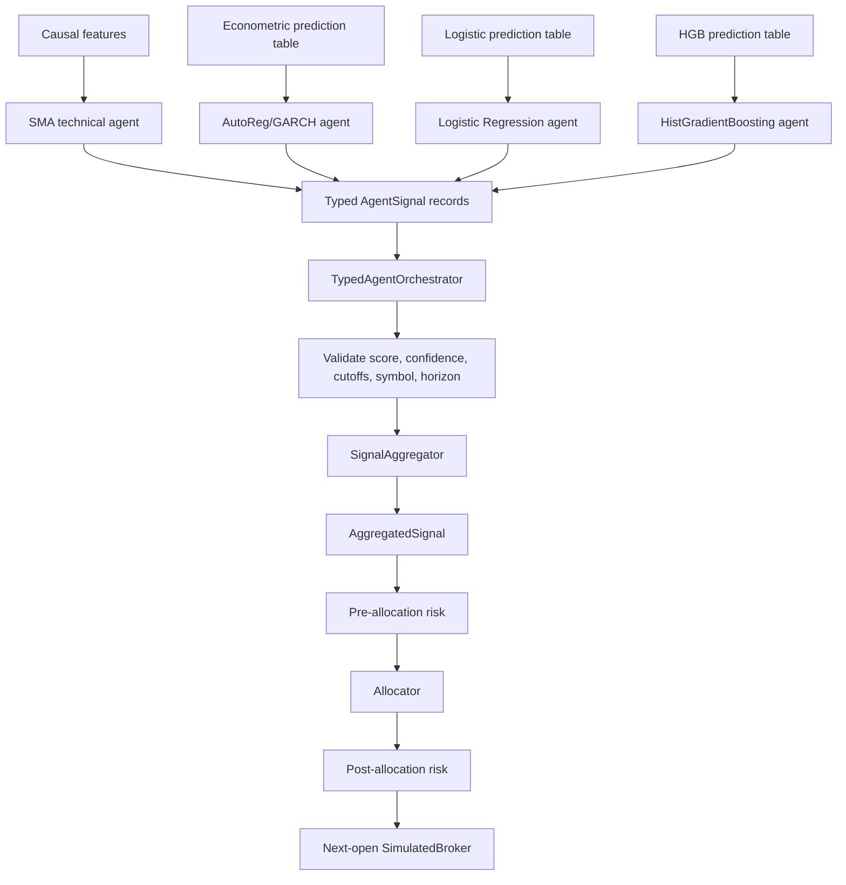
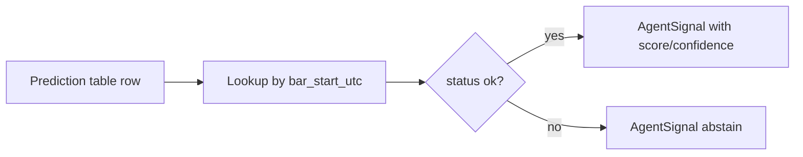
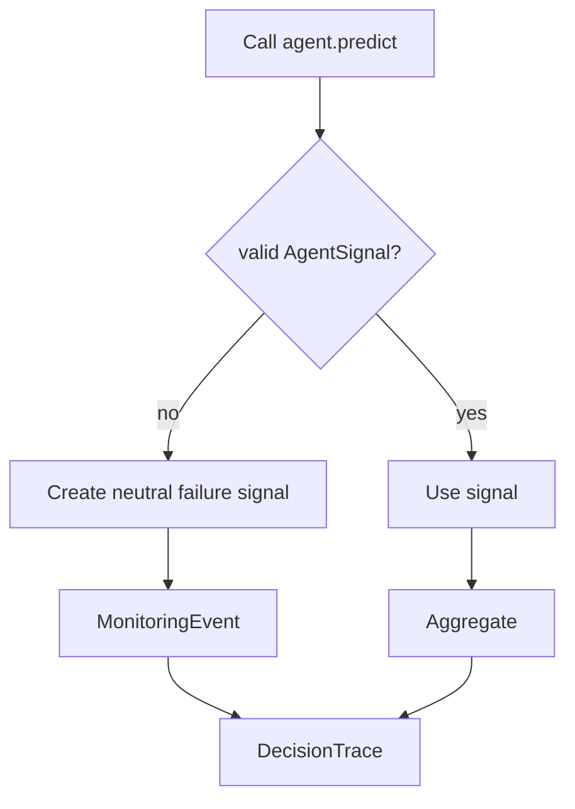
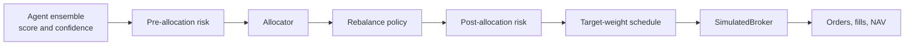

# Agent Ensemble

## Purpose

The final Level 2 agent is the `agent_ensemble` approach. It does not train a
new model and it does not place trades directly. Its job is to combine several
typed signal agents into one auditable portfolio intent.

The ensemble consumes:

- a technical SMA crossover signal;
- an econometric AutoReg/GARCH signal;
- a Logistic Regression signal;
- a HistGradientBoosting signal.

It then emits normalized scores and confidence values that can be passed to risk
controls, allocation, rebalancing, and the shared next-open broker.

## Main Idea

The project separates model prediction from trading execution.

```text
models and rules -> typed agent signals -> ensemble aggregate -> risk/allocation -> broker
```

The ensemble is therefore not a live trader. It is an auditable decision layer
that records:

- which agents contributed;
- each agent's score and confidence;
- what timestamps and cutoffs were used;
- whether any agent abstained or failed;
- whether agents disagreed too much;
- what final aggregate score was produced.

## High-Level Flow



## Implementation Map

| Area | File | What to look for |
| --- | --- | --- |
| Ensemble model card | [`reports/model_cards/ensemble_orchestrator.md`](../reports/model_cards/ensemble_orchestrator.md) | Reader-facing summary of the orchestrator responsibility, cutoffs, validation, abstention, trading mapping, metrics, and risks. |
| Typed signal data structures | [`src/crypto_hedge_fund/types.py`](../src/crypto_hedge_fund/types.py) | `AgentContext`, `AgentSignal`, `AggregatedSignal`, `DecisionTrace`, and `MonitoringEvent` define the typed agent contract. |
| Orchestrator | [`src/crypto_hedge_fund/agents/orchestrator.py`](../src/crypto_hedge_fund/agents/orchestrator.py) | `TypedAgentOrchestrator` calls agents, catches failures, validates outputs, records monitoring events, and creates a `DecisionTrace`. |
| Signal aggregation | [`src/crypto_hedge_fund/agents/aggregate.py`](../src/crypto_hedge_fund/agents/aggregate.py) | `SignalAggregator` combines active agent scores using configured agent weights and confidence. It also records contributions and disagreement. |
| Level 2 prediction-table agents | [`src/crypto_hedge_fund/agents/level2.py`](../src/crypto_hedge_fund/agents/level2.py) | `PredictionTableSignalAgent` converts causal prediction rows from ML/econometric models into typed `AgentSignal` records. |
| Base signal agents | [`src/crypto_hedge_fund/agents/base.py`](../src/crypto_hedge_fund/agents/base.py) | Contains generic typed agents and examples such as momentum and regime-style signal emitters. |
| SMA technical agent | [`src/crypto_hedge_fund/strategies/sma.py`](../src/crypto_hedge_fund/strategies/sma.py) | `SMACrossoverSignalAgent` emits the technical trend-following signal used in Level 1 and the Level 2 ensemble. |
| Level 2 ensemble construction | [`src/crypto_hedge_fund/experiments/level_2.py`](../src/crypto_hedge_fund/experiments/level_2.py) | `_approach_agents()` builds individual approaches and the final `agent_ensemble`. `build_level_2_target_schedule()` runs the orchestrator, risk gates, allocator, and target-weight schedule. |
| Selected frozen configuration | [`configs/validation_selected.yaml`](../configs/validation_selected.yaml) | Records `selected_approach: agent_ensemble`, agent weights, ML retrain cadence, and econometric refit cadence. |
| Default configuration | [`configs/default.yaml`](../configs/default.yaml) | Contains default Level 2 weights, retrain cadence, and risk settings such as maximum agent disagreement. |
| Decision trace artifact | [`artifacts/monitoring/level_2_decision_trace.json`](../artifacts/monitoring/level_2_decision_trace.json) | Stored validation trace for the selected ensemble path. It shows signals, aggregates, constraints, proposals, approvals, and events. |
| Level 2 figure | [`artifacts/figures/level_2_equity_curve.png`](../artifacts/figures/level_2_equity_curve.png) | Compares individual agents and the ensemble in validation. |

## Typed Agent Contract

Every agent must return `AgentSignal` records. A signal is not an order. It is a
typed proposal with bounded values and audit fields.

Core fields:

| Field | Meaning |
| --- | --- |
| `symbol` | Market pair being scored, such as `BTC/USDT`. |
| `agent` | Agent name, such as `sma_crossover` or `ml_logistic`. |
| `score` | Normalized directional score in `[-1, 1]`. |
| `confidence` | Confidence in `[0, 1]`. |
| `horizon_open_days` | Forecast horizon measured in open-to-open days. |
| `fit_cutoff` | Latest time the model fit was allowed to use. |
| `feature_cutoff` | Latest completed-bar time used by the signal. |
| `reason_codes` | Explicit status such as `ok`, `abstain`, `model_failure`, or `agent_disagreement`. |
| `metadata` | Model-specific details such as probability, expected return, volatility, or method name. |

The typed contract prevents loose model outputs from silently becoming trades.
The orchestrator validates score bounds, confidence bounds, symbols, and
timestamps before aggregation.

## Ensemble Components

For Level 2, the ensemble is built in `_approach_agents()`:

```text
agent_ensemble =
    SMA crossover agent
  + econometric AutoReg/GARCH prediction-table agent
  + Logistic Regression prediction-table agent
  + HistGradientBoosting prediction-table agent
```

The frozen selected weights are equal:

```text
technical:               0.25
econometric:             0.25
logistic:                0.25
hist_gradient_boosting:  0.25
```

These are base agent weights. The aggregator also multiplies by each agent's
confidence, so a low-confidence signal has less influence.

## Prediction-Table Agents

The ML and econometric models are trained before the agent layer emits signals.
Their outputs are stored as prediction tables with columns such as:

```text
bar_start_utc
execution_time
feature_cutoff
fit_cutoff
probability
score
confidence
target_label
forward_return
status
train_samples
refit_frequency
used_future_labels
```

`PredictionTableSignalAgent` looks up the row for the current `bar_start_utc`
and turns it into an `AgentSignal`.



If the row is missing, stale, or marked as failed, the agent emits a neutral
abstention:

```text
score = 0.0
confidence = 0.0
reason_codes = abstain / model_failure
```

## Aggregation Formula

The aggregator uses only active signals:

```text
active = signals without abstain and with confidence > 0
```

Each active signal receives an effective weight:

```text
effective_weight_i = configured_agent_weight_i * confidence_i
```

The aggregate score is a weighted average:

```text
aggregate_score =
    sum(score_i * effective_weight_i) / sum(effective_weight_i)
```

The aggregate confidence is bounded:

```text
aggregate_confidence =
    min(1.0, sum(effective_weight_i) / number_of_active_agents)
```

The contribution dictionary records how much each agent contributed to the final
score:

```text
contribution_i =
    score_i * effective_weight_i / sum(effective_weight_i)
```

## Simple Numerical Example

Assume four active agents:

| Agent | Config weight | Score | Confidence |
| --- | ---: | ---: | ---: |
| SMA | 0.25 | 0.80 | 1.00 |
| AutoReg/GARCH | 0.25 | -0.20 | 0.50 |
| Logistic | 0.25 | 0.30 | 0.60 |
| HGB | 0.25 | 0.10 | 0.40 |

Effective weights:

```text
SMA:            0.25 * 1.00 = 0.250
AutoReg/GARCH: 0.25 * 0.50 = 0.125
Logistic:      0.25 * 0.60 = 0.150
HGB:           0.25 * 0.40 = 0.100
Total:                         0.625
```

Aggregate score:

```text
(0.80 * 0.250 + -0.20 * 0.125 + 0.30 * 0.150 + 0.10 * 0.100) / 0.625
= (0.200 - 0.025 + 0.045 + 0.010) / 0.625
= 0.368
```

The final ensemble score is positive, but less aggressive than the SMA signal
because other agents were weaker or partially disagreeing.

## Disagreement Handling

The aggregator measures disagreement as half of the active score range:

```text
disagreement = (max(active_scores) - min(active_scores)) / 2
```

Example:

```text
max score = 0.80
min score = -0.20
disagreement = (0.80 - -0.20) / 2 = 0.50
```

If disagreement exceeds the configured threshold, the aggregate signal receives
an `agent_disagreement` reason code. This does not place an order by itself; it
is passed forward so risk and allocation can treat the signal conservatively.

## Orchestrator Fail-Closed Behavior

The orchestrator is designed to fail closed. If an agent raises an exception or
returns invalid output, the orchestrator creates a neutral failure signal instead
of letting bad data move into portfolio construction.



Common failure or abstention reasons include:

- missing prediction row;
- warmup period;
- model failure;
- invalid score or confidence;
- stale or inconsistent cutoff;
- symbol not in the decision context;
- feature cutoff after decision time;
- excessive agent disagreement.

## Decision Trace

Every orchestrator run returns a `DecisionTrace`. For the selected Level 2
ensemble path, traces are written to:

```text
artifacts/monitoring/level_2_decision_trace.json
```

The trace records:

- the research clock;
- raw agent signals;
- aggregate signals;
- risk constraints;
- portfolio proposal;
- risk approval;
- monitoring events;
- metadata.

This is the audit trail that explains how a completed bar became a target weight
or a decision to hold/cash.

## Relationship To Risk And Execution

The ensemble is upstream of trading. It emits intent, not orders.



This matters because a strong ensemble score can still be blocked or reduced by:

- stale data;
- missing next-open prices;
- volatility limits;
- liquidity or capacity limits;
- maximum weight caps;
- turnover constraints;
- cost-aware rebalance logic;
- infeasible optimization;
- post-allocation risk rejection.

## Level Usage

The agent ensemble is most explicit in Level 2, where the project compares
individual agents and the combined ensemble on BTC/USDT.

In higher levels, the same typed-agent idea remains part of the architecture:
signals are separated from risk, allocation, rebalancing, and execution. Level 5
uses deterministic large-universe scoring rather than the exact Level 2
four-agent BTC ensemble, but it keeps the same principle: score first, then risk
and allocation, then broker execution.

## What The Ensemble Proves

The ensemble proves that the project can combine heterogeneous model families in
one auditable decision interface:

```text
technical trend rule
+ econometric expected return / volatility
+ classical ML probabilities
+ reason-coded abstention and failures
+ confidence-weighted aggregation
+ risk-controlled execution downstream
```

The validation result does not mean the ensemble is guaranteed to outperform the
best individual line in every period. It means the system can combine multiple
research agents under one causal, typed, reproducible architecture.

## Short Defense Summary

```text
The final agent is an ensemble orchestrator, not a trading bot. It consumes typed
signals from SMA, AutoReg/GARCH, Logistic Regression, and HistGradientBoosting
agents. Each signal includes score, confidence, horizon, cutoffs, and reason
codes. The aggregator combines active signals using configured weights multiplied
by confidence, records contributions and disagreement, and emits one aggregate
signal per symbol. Risk gates, allocation, rebalance policy, and the shared
broker decide whether that intent becomes a simulated fill.
```
