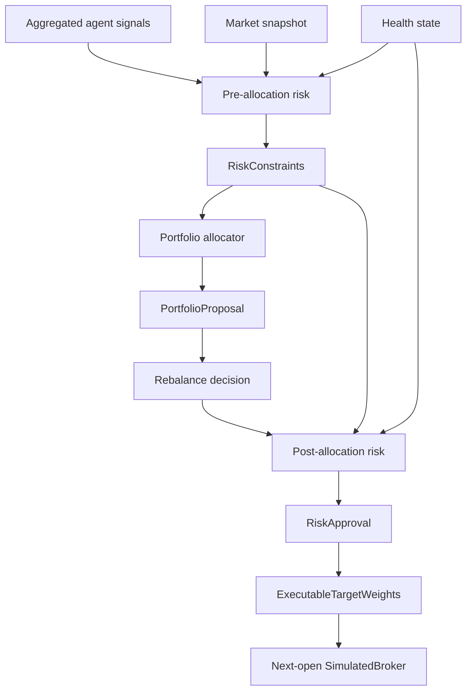
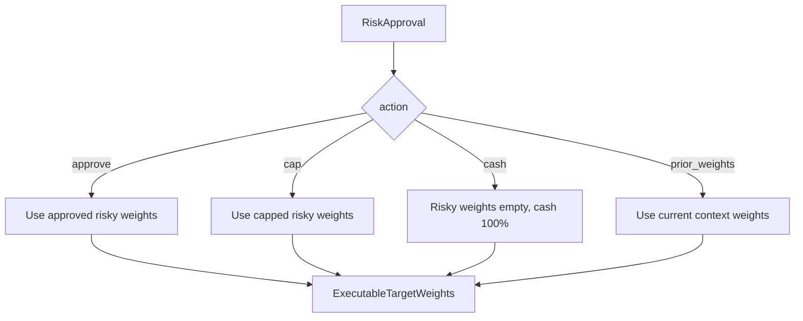
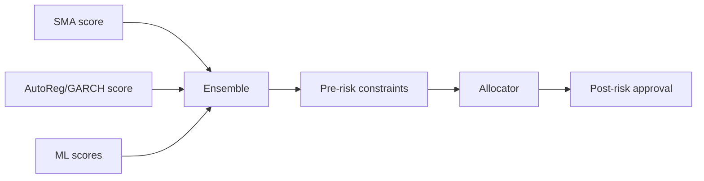

# Risk Management

## Purpose

Risk management is the layer that decides whether model and agent intent is safe
enough to turn into target weights and simulated broker execution.

The project uses a two-stage risk design:

```text
pre-allocation risk  -> before the allocator builds a portfolio
post-allocation risk -> after candidate weights exist, before broker execution
```

This separation is intentional. An asset can have a strong model score but still
be blocked because of stale data, missing prices, low liquidity, model age,
agent disagreement, concentration, volatility, drawdown, turnover, or infeasible
weights.

## High-Level Flow



The risk layer does not compute alpha. It converts signal and market-health
information into constraints, approvals, caps, holds, or cash fallbacks.

## Implementation Map

| Area | File | What to look for |
| --- | --- | --- |
| Pre-allocation risk gate | [`src/crypto_hedge_fund/risk/pre_allocation.py`](../src/crypto_hedge_fund/risk/pre_allocation.py) | `PreAllocationRiskPolicy.constraints()` validates signal health, market freshness, liquidity, model age, agent disagreement, kill switch, and creates `RiskConstraints`. |
| Post-allocation risk gate | [`src/crypto_hedge_fund/risk/post_allocation.py`](../src/crypto_hedge_fund/risk/post_allocation.py) | `PostAllocationRiskPolicy.approve()` validates candidate portfolio weights after allocation and can approve, cap, hold prior weights, or move to cash. |
| Risk action resolver | [`src/crypto_hedge_fund/risk/post_allocation.py`](../src/crypto_hedge_fund/risk/post_allocation.py) | `resolve_risk_approval_targets()` converts `RiskApproval` actions into executable target weights before broker integration. |
| Risk typed records | [`src/crypto_hedge_fund/types.py`](../src/crypto_hedge_fund/types.py) | `RiskConstraints`, `RiskApproval`, `ExecutableTargetWeights`, `RiskAction`, and `ReasonCode` define the typed risk contract. |
| Allocator interaction | [`src/crypto_hedge_fund/portfolio/allocators.py`](../src/crypto_hedge_fund/portfolio/allocators.py) | Allocators respect blocked symbols, per-asset caps, gross exposure, and return `PortfolioProposal` records. |
| Rebalance interaction | [`src/crypto_hedge_fund/portfolio/rebalance.py`](../src/crypto_hedge_fund/portfolio/rebalance.py) | Rebalance policies decide whether a candidate portfolio should be submitted after considering drift, calendar, signal changes, and expected costs. |
| Level 1 risk path | [`src/crypto_hedge_fund/experiments/level_1.py`](../src/crypto_hedge_fund/experiments/level_1.py) | SMA signal still passes through pre-risk, allocation, rebalance, post-risk, and broker execution. |
| Level 2 risk path | [`src/crypto_hedge_fund/experiments/level_2.py`](../src/crypto_hedge_fund/experiments/level_2.py) | `build_level_2_target_schedule()` runs aggregated agent signals through both risk gates before target weights are sent to the broker. |
| Level 4 risk path | [`src/crypto_hedge_fund/experiments/level_4.py`](../src/crypto_hedge_fund/experiments/level_4.py) | Dynamic rebalancing adds risk-triggered rebalance behavior and a rebalance log. |
| Level 5 risk/scoring path | [`src/crypto_hedge_fund/experiments/level_5.py`](../src/crypto_hedge_fund/experiments/level_5.py) | Large-universe selection and constrained portfolio construction use the same risk-management principles. |
| Risk configuration | [`configs/default.yaml`](../configs/default.yaml) | Contains drawdown stop, high-volatility threshold, max agent disagreement, effective holdings, and post-allocation validation settings. |
| Frozen selected configuration | [`configs/validation_selected.yaml`](../configs/validation_selected.yaml) | Records selected risk and portfolio settings frozen before final-test exposure. |
| Regime model card | [`reports/model_cards/regime_agent.md`](../reports/model_cards/regime_agent.md) | Documents volatility/risk-on/risk-off context and controlled-stop behavior. |
| Ensemble model card | [`reports/model_cards/ensemble_orchestrator.md`](../reports/model_cards/ensemble_orchestrator.md) | Explains how invalid scores, disagreement, and risk breaches produce abstention, cash, caps, or block actions. |

## Pre-Allocation Risk

Pre-allocation risk runs before optimization or allocation. Its output is a
`RiskConstraints` object.

It answers:

```text
Which symbols are eligible for allocation right now?
How much can each symbol receive at most?
What is the maximum total risky exposure?
Should any symbols be blocked before the allocator sees them?
```

Main checks:

| Check | Effect |
| --- | --- |
| Kill switch | Blocks all symbols. |
| Missing aggregate signal | Blocks the symbol. |
| Invalid/stale signal reason code | Blocks the symbol. |
| Agent disagreement above threshold | Blocks the symbol. |
| Model fit too old | Blocks the symbol. |
| Missing or stale market snapshot | Blocks the symbol. |
| Dollar volume below minimum | Blocks the symbol. |
| Liquidity-based max weight | Reduces per-asset cap. |
| Cost buffer | Keeps part of the portfolio in cash so costs are feasible. |

The result looks conceptually like:

```text
RiskConstraints:
    max_gross_exposure = 0.995
    per_asset_caps = {
        BTC/USDT: 0.30,
        ETH/USDT: 0.30,
        DOGE/USDT: 0.00
    }
    blocked_symbols = [DOGE/USDT]
    turnover_cap = 0.35
    reason_codes = [low_liquidity]
```

The allocator must respect this object. It cannot allocate positive weight to a
blocked symbol and cannot exceed per-asset caps.

## Post-Allocation Risk

Post-allocation risk runs after a candidate portfolio already exists. Its output
is a `RiskApproval`.

It answers:

```text
Are these exact target weights acceptable?
Should they be approved, capped, rejected, held, or moved to cash?
```

Main checks:

| Check | Possible action |
| --- | --- |
| Kill switch active | Move to cash. |
| Drawdown above stop | Move to cash. |
| Realized volatility above threshold | Move to cash. |
| Optimizer/allocation failure | Move to cash. |
| Rebalance not justified | Keep prior weights. |
| Reconciliation failure | Move to cash. |
| Capacity breach | Move to cash. |
| Invalid weights or cash | Move to cash. |
| Blocked symbol has positive weight | Move to cash. |
| Weight above cap | Cap the weight. |
| Gross exposure too high | Scale risky weights down. |
| Turnover above cap | Keep prior weights. |
| Portfolio volatility above target | Move to cash. |

Post-risk is stricter because it validates the actual portfolio that would be
sent to the broker.

## Risk Actions

The post-risk layer uses explicit actions. This avoids ambiguous behavior.

| Action | Meaning |
| --- | --- |
| `approve` | Candidate weights are acceptable. |
| `cap` | Candidate weights are accepted after reducing risky weights or per-asset weights. |
| `cash` | Move to 100% cash / no risky positions. |
| `prior_weights` | Do not rebalance; keep current feasible weights. |

The resolver turns these actions into `ExecutableTargetWeights`.



This is important because even rejected actions still produce an explicit safe
target. The caller does not have to guess whether to skip, hold, or cash out.

## Reason Codes

Risk decisions are reason-coded. They are not just booleans.

Common reason codes include:

- `kill_switch`;
- `drawdown_stop`;
- `volatility_limit`;
- `stale_data`;
- `stale_model`;
- `low_liquidity`;
- `agent_disagreement`;
- `optimizer_failure`;
- `turnover_limit`;
- `concentration_limit`;
- `capacity_limit`;
- `weight_reconciliation_failure`;
- `reconciliation_failure`.

Reason codes appear in traces, monitoring events, approvals, constraints, and
artifacts. This makes risk behavior inspectable after the run.

## Configuration

Core risk settings are configured in YAML.

Examples:

```text
risk.max_drawdown_stop = 0.20
risk.high_volatility_threshold_annual = 0.80
risk.max_agent_disagreement = 0.75
risk.min_effective_holdings = 5
risk.post_allocation_validation = true
```

Interpretation:

```text
max_drawdown_stop 0.20
    If drawdown is at or above 20%, post-risk can move the portfolio to cash.

high_volatility_threshold_annual 0.80
    If annualized realized volatility is at or above 80%, post-risk can move to cash.

max_agent_disagreement 0.75
    If active agents disagree too much, pre-risk can block allocation.

post_allocation_validation true
    Candidate weights are checked after allocation and before broker execution.
```

## Relationship To Agents

Agents emit intent. Risk decides whether that intent is usable.



Examples:

```text
Strong positive score + stale data
    -> pre-risk blocks the symbol.

Strong positive score + high volatility regime
    -> post-risk can move the portfolio to cash.

Weak but valid score + no rebalance trigger
    -> keep prior weights.

Valid allocation + too much concentration
    -> cap the weight.
```

## Relationship To Backtesting

The broker does not decide whether a portfolio is safe. The broker executes only
the target weights that risk has resolved.

```text
RiskApproval -> ExecutableTargetWeights -> SimulatedBroker -> orders/fills/ledger
```

This means risk management sits between research signals and accounting. It can
prevent unsafe or infeasible weights from ever becoming simulated orders.

## Minimal Numerical Examples

### Per-Asset Cap

Assume the allocator proposes:

```text
BTC/USDT = 0.60
cash     = 0.40
```

But the risk cap is:

```text
max_per_asset_weight = 0.30
```

Post-risk caps BTC:

```text
BTC/USDT = 0.30
cash     = 0.70
action   = cap
reason   = concentration_limit
```

### Gross Exposure Cap

Assume proposed risky weights sum to `1.00`, but the effective max gross
exposure is `0.995` because the system keeps a `0.5%` cost buffer.

```text
risky_sum before = 1.000
max_risky_sum    = 0.995
```

Post-risk scales risky weights down and leaves cash for costs:

```text
risky_sum after = 0.995
cash            = 0.005
```

### Drawdown Stop

Assume health state says:

```text
drawdown = 0.22
max_drawdown_stop = 0.20
```

Post-risk action:

```text
approved_weights = {}
cash_weight = 1.0
action = cash
reason = drawdown_stop
```

### Turnover Limit

Assume a candidate rebalance would require too much trading:

```text
proposal.expected_turnover = 0.50
constraints.turnover_cap = 0.35
```

Post-risk action:

```text
action = prior_weights
reason = turnover_limit
```

The system keeps the current portfolio rather than paying excessive costs.

## What Risk Management Proves

The risk layer proves that the project is not simply converting model scores
into trades. It enforces a controlled path:

```text
score -> constraints -> allocation -> approval -> executable target -> broker
```

This is why the architecture can honestly say:

```text
A strong signal can still be blocked by risk, capacity, missing prices, or
cost-aware rebalance logic.
```

## Short Defense Summary

```text
Risk management is implemented as a two-stage gate. Pre-allocation risk converts
signals and market health into constraints such as blocked symbols, per-asset
caps, max gross exposure, turnover caps, and volatility targets. The allocator
must respect those constraints. Post-allocation risk then validates the exact
candidate weights and can approve, cap, hold prior weights, or move to cash.
Only risk-resolved target weights are sent to the simulated broker.
```
